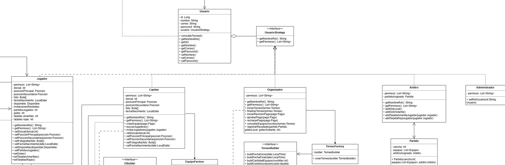

# TECHCUP

## Nombre del equipo
**Testigos de Jehóva**

## Nombre de los integrantes
**- Cristian Adrian Ducuara Quiñonez**

**- Cristian Ronaldo Guerrero Buitrago**

**- Javier Mauricio Deaquiz Romero**

**- Juan Esteban Tellez Valencia**

**- Juan Sebastian González Aranguren**

## Titulo del proyecto
**TECHCUP**

## Enunciado del problema
Los programas de Ingeniería de Sistemas, IA, Ciberseguridad y Estadística realizan cada semestre un torneo interno de 
fútbol en el que participan estudiantes de distintos semestres. Aunque la actividad tiene alta acogida, su organización 
actualmente depende de procesos manuales: mensajes por WhatsApp, formularios aislados y hojas de cálculo.
Esta forma de manejo genera desorden, retrasos y confusión entre participantes y organizadores. Muchos estudiantes no 
conocen el proceso de inscripción, los equipos se completan tarde, los pagos se verifi can manualmente y la información 
del torneo (fechas, reglas, resultados) se encuentra dispersa.
TECHCUP FÚTBOL propone desarrollar una plataforma web que centralice toda la gestión del torneo, permitiendo que 
estudiantes, capitanes y organizadores interactúen en un solo sistema organizado y transparente.

Actualmente, el torneo presenta las siguientes dificultades:

● El proceso de inscripción no es claro para los participantes.

● Los capitanes tienen problemas para completar sus equipos.

● Los pagos no se verifican de forma rápida y es un proceso manual.

● Los resultados y la tabla de posiciones se actualizan manualmente.

● Las llaves eliminatorias se organizan a mano.

● No existe historial ni estadísticas del torneo.

● La información oficial está dispersa.

● Esto ocasiona retrasos, errores administrativos y conflictos entre los participantes.

## Índice

### **- Diagramas TECHCUP:**

[Diagramas TECHCUP](/docs/uml/README.md)

### **- Definicion de requerimientos:**

[Definicion Requerimientos](/docs/requirements/README.md)

### **- Patrones de diseño**

**- Builder:**
El sistema TECHCUP maneja varias entidades con una característica común: todas tienen atributos obligatorios que siempre
deben estar presentes y atributos opcionales que el usuario puede o no diligenciar. Sin Builder, la única alternativa
sería un constructor con todos los parámetros posibles, lo que en Java generaría métodos como:

    new Jugador("juan@escuelaing.edu.co", "Juan Pérez", null, null, null, false)

Ese código es ilegible, propenso a errores al invertir el orden de los parámetros, y no garantiza que el objeto se
construya en un estado válido. Builder resuelve exactamente ese problema.

El como ayuda a resolver el problema: Se aplicó en tres entidades distintas del sistema, cada una con su propia
justificación:

Torneo: El organizador debe ingresar obligatoriamente fecha inicial, fecha final, cantidad de equipos y costo por
equipo. Sin embargo, el reglamento y el cierre de inscripciones son opcionales al momento de la creación y pueden
configurarse después. Builder permite que el torneo siempre se cree en estado BORRADOR con los campos mínimos válidos,
sin forzar al organizador a tener todo definido desde el primer momento.

Usuario: El registro inicial solo requiere correo y nombre. La foto, el dorsal, las posiciones de juego y la
disponibilidad son datos del perfil deportivo que el jugador completa progresivamente. Builder separa claramente qué es
obligatorio al registrarse y qué puede configurarse después, sin que el objeto quede en un estado inválido en ningún
momento.

Equipo: El capitán debe definir obligatoriamente el nombre del equipo al crearlo. El escudo y los colores del uniforme
son opcionales.

**- Stategy:**
El sistema tiene cinco tipos de actores: Jugador, Capitán, Organizador, Árbitro y Administrador. La solución más
intuitiva sería crear una clase separada por cada rol mediante herencia, pero esto genera un problema estructural
importante: un mismo usuario puede cambiar de rol en tiempo de ejecución. El caso más claro del sistema es el Capitán,
que es un Jugador que creó un equipo y vuelve a ser Jugador si lo abandona. Con herencia eso es imposible porque el
tipo de un objeto no cambia después de su creación.

Strategy resuelve esto porque el comportamiento del rol se encapsula en un objeto separado que puede intercambiarse sin
modificar el usuario que lo contiene.

