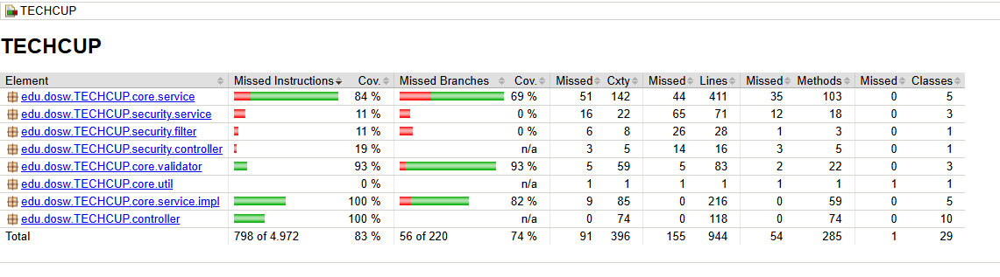
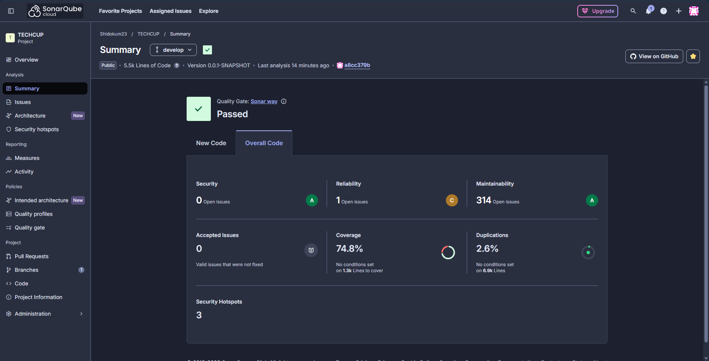
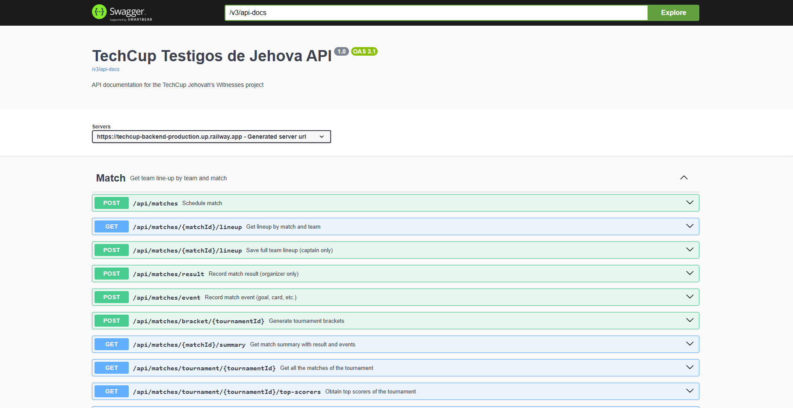
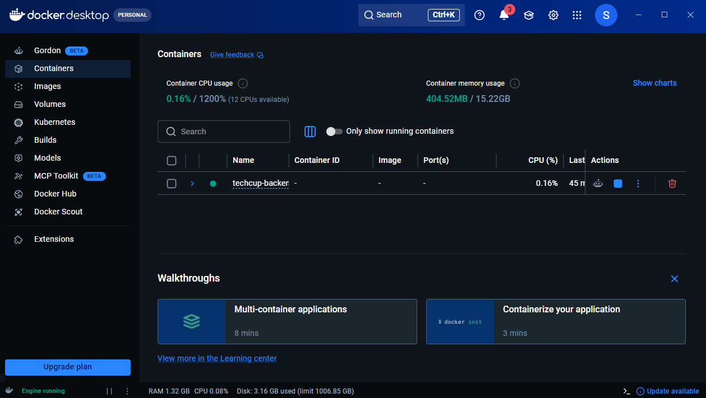
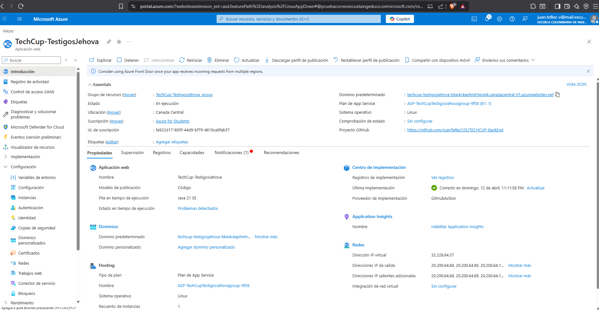

# TechCup - Backend API

API REST para la gestión del torneo relámpago de fútbol de la Decanatura de Ingeniería de Sistemas de la Escuela Colombiana de Ingeniería Julio Garavito.

## Tabla de Contenidos

- [Integrantes](#integrantes)
- [Contexto del Proyecto](#contexto-del-proyecto)
- [Descripción](#descripción)
- [Tecnologías](#tecnologías)
- [Arquitectura](#arquitectura)
- [Requisitos Previos](#requisitos-previos)
- [Instalación](#instalación)
- [Configuración](#configuración)
- [Ejecución](#ejecución)
- [Estructura del Proyecto](#estructura-del-proyecto)
- [API Endpoints](#api-endpoints)
- [Base de Datos](#base-de-datos)
- [Seguridad](#seguridad)
- [Pruebas](#pruebas)
- [Documentación API](#documentación-api)
- [Despliegue](#despliegue)
- [Variables de Entorno](#variables-de-entorno)
- [Contribución](#contribución)
- [Documentación Adicional](#documentación-adicional)

---

## Integrantes

**Squad DOSW - Testigos de Jehová**

- Cristian Adrian Ducuara Quiñonez
- Cristian Ronaldo Guerrero Buitrago
- Javier Mauricio Romero Deaquiz
- Juan Esteban Tellez Valencia
- Juan Sebastian Gonzalez Aranguren

---

## Contexto del Proyecto

Esta API REST centraliza la gestión del torneo relámpago de fútbol universitario, resolviendo los problemas actuales de organización manual mediante WhatsApp, formularios aislados y hojas de cálculo.

### Problemática

- Información dispersa en múltiples canales
- Falta de trazabilidad en cambios
- Dificultad para consultar estadísticas
- Proceso manual propenso a errores

### Solución

API robusta que permite:
- Gestión completa de equipos y jugadores
- Registro y seguimiento de partidos
- Cálculo automático de estadísticas
- Sistema de autenticación y autorización
- Generación de tabla de posiciones en tiempo real

---

## Descripción

TechCup Backend es una API REST desarrollada con Spring Boot que proporciona todos los servicios necesarios para la gestión integral del torneo de fútbol. Implementa una arquitectura MVC con buenas prácticas de desarrollo, seguridad mediante JWT y persistencia con JPA/Hibernate.

---

## Tecnologías

### Core

- **Java** 17
- **Spring Boot** 3.2.x
- **Maven** 4.0.0

### Frameworks y Librerías

- **Spring Web** - Desarrollo de API REST
- **Spring Data JPA** - Capa de persistencia
- **Spring Security** - Autenticación y autorización
- **Hibernate** - ORM
- **PostgreSQL** - Base de datos relacional
- **Lombok** - Reducción de código boilerplate
- **MapStruct** - Mapeo de DTOs

### Seguridad

- **JWT (JSON Web Tokens)** - Autenticación stateless
- **BCrypt** - Hashing de contraseñas
- **Spring Security** - Control de acceso basado en roles

### Documentación

- **Swagger/OpenAPI** 3.0 - Documentación interactiva de API
- **SpringDoc OpenAPI** - Generación automática de docs

### Testing

- **JUnit 5** - Framework de pruebas unitarias
- **Mockito** - Mocking de dependencias
- **Spring Boot Test** - Pruebas de integración
- **JaCoCo** - Análisis de cobertura de código
- **SonarQube** - Análisis estático de calidad

### DevOps

- **Docker** - Contenedorización
- **GitHub Actions** - CI/CD
- **Azure App Service** - Hosting
- **Azure Database for PostgreSQL** - Base de datos en la nube

---

## Arquitectura

### Patrón MVC (Model-View-Controller)

```bash

┌─────────────┐
│   Client    │
│  (Frontend) │
└──────┬──────┘
│ HTTP Request
↓
┌─────────────────────────────────────┐
│         Controller Layer            │
│  - Recibe requests                  │
│  - Valida entrada                   │
│  - Delega a Service                 │
│  - Retorna ResponseEntity           │
└──────────────┬──────────────────────┘
│
↓
┌─────────────────────────────────────┐
│          Service Layer              │
│  - Lógica de negocio                │
│  - Transacciones                    │
│  - Orquestación                     │
│  - Manejo de excepciones            │
└──────────────┬──────────────────────┘
│
↓
┌─────────────────────────────────────┐
│       Repository Layer              │
│  - Acceso a datos (JPA)             │
│  - Queries personalizadas           │
│  - Persistencia                     │
└──────────────┬──────────────────────┘
│
↓
┌─────────────────────────────────────┐
│         Database Layer              │
│  - PostgreSQL                       │
│  - Esquemas y tablas                │
└─────────────────────────────────────┘
```

### Capas de la Aplicación

1. **Controller (Presentación)**
    - Endpoints REST
    - Validación de entrada con `@Valid`
    - Serialización JSON
    - Códigos de estado HTTP apropiados

2. **Service (Lógica de Negocio)**
    - Implementación de casos de uso
    - Reglas de negocio del torneo
    - Transacciones con `@Transactional`
    - Manejo de excepciones custom

3. **Repository (Persistencia)**
    - Interfaces JPA Repository
    - Queries JPQL personalizadas
    - Métodos derivados de nombres

4. **Model (Dominio)**
    - Entidades JPA
    - Relaciones entre entidades
    - Constraints y validaciones

5. **DTO (Data Transfer Objects)**
    - Objetos para transferencia de datos
    - Separación entre modelo de dominio y API
    - Validaciones con Bean Validation

### Patrones de Diseño Implementados

- **Repository Pattern** - Abstracción de persistencia
- **Service Layer Pattern** - Encapsulación de lógica de negocio
- **DTO Pattern** - Transferencia de datos
- **Dependency Injection** - Inversión de control con Spring
- **Exception Handling** - Manejo centralizado de errores

---

## Requisitos Previos

- **Java JDK** 21 o superior
- **Maven** 3.6+ (o usar Maven Wrapper incluido)
- **PostgreSQL** 14+ (local o Azure)
- **Docker** (opcional, para desarrollo con contenedores)
- **Git**

Verificar instalaciones:

```bash
java -version
mvn -version
psql --version
docker --version
```

---

## Instalación

### 1. Clonar el Repositorio

```bash
git clone https://github.com/JuanTellez125/TECHCUP-BackEnd.git
cd TECHCUP-BackEnd
```

### 2. Cambiar a la Rama de Desarrollo

```bash
git checkout develop
```

### 3. Instalar Dependencias

```bash
mvn clean install
```

O usando Maven Wrapper:

```bash
./mvnw clean install
```

---

## Configuración

### Base de Datos Local

1. Crear base de datos PostgreSQL:

```sql
CREATE DATABASE techcup_db;
CREATE USER techcup_user WITH PASSWORD 'techcup_password';
GRANT ALL PRIVILEGES ON DATABASE techcup_db TO techcup_user;
```

2. Configurar `application-dev.properties`:

```properties
# Datasource
spring.datasource.url=jdbc:postgresql://localhost:5432/techcup_db
spring.datasource.username=techcup_user
spring.datasource.password=techcup_password

# JPA/Hibernate
spring.jpa.hibernate.ddl-auto=update
spring.jpa.show-sql=true
spring.jpa.properties.hibernate.format_sql=true

# JWT
jwt.secret=your-secret-key-here
jwt.expiration=86400000
```

### Variables de Entorno

Crear archivo `.env` en la raíz del proyecto:

```env
# Database
DB_HOST=localhost
DB_PORT=5432
DB_NAME=techcup_db
DB_USERNAME=techcup_user
DB_PASSWORD=techcup_password

# JWT
JWT_SECRET=your-256-bit-secret-key
JWT_EXPIRATION=86400000

# Environment
SPRING_PROFILES_ACTIVE=dev
```

**Importante:** El archivo `.env` está en `.gitignore` y no debe ser commiteado.

---

## Ejecución

### Modo Desarrollo

```bash
mvn spring-boot:run
```

O con Maven Wrapper:

```bash
./mvnw spring-boot:run
```

La API estará disponible en: `http://localhost:8080`

### Ejecutar con Perfil Específico

```bash
mvn spring-boot:run -Dspring-boot.run.profiles=dev
```

### Generar JAR

```bash
mvn clean package
java -jar target/techcup-backend-0.0.1-SNAPSHOT.jar
```

---

## Estructura del Proyecto
```bash
├───src
│   ├───main
│   │   ├───java
│   │   │   └───edu
│   │   │       └───dosw
│   │   │           └───TECHCUP
│   │   │               │   TechcupApplication.java
│   │   │               │
│   │   │               ├───config
│   │   │               │       SwaggerConfig.java
│   │   │               │
│   │   │               ├───controller
│   │   │               │   │   AdministratorController.java
│   │   │               │   │   CaptainController.java
│   │   │               │   │   GlobalExceptionHandler.java
│   │   │               │   │   LineUpController.java
│   │   │               │   │   MatchController.java
│   │   │               │   │   OrganizerController.java
│   │   │               │   │   PaymentController.java
│   │   │               │   │   PlayerController.java
│   │   │               │   │   RefereeController.java
│   │   │               │   │   TeamController.java
│   │   │               │   │   TestController.java
│   │   │               │   │   TournamentController.java
│   │   │               │   │
│   │   │               │   ├───dto
│   │   │               │   │   ├───request
│   │   │               │   │   │       InvitationRequestDTO.java
│   │   │               │   │   │       LineUpEntryDTO.java
│   │   │               │   │   │       LineUpRequestDTO.java
│   │   │               │   │   │       MatchEventRequestDTO.java
│   │   │               │   │   │       MatchRequestDTO.java
│   │   │               │   │   │       MatchResultRequestDTO.java
│   │   │               │   │   │       PaymentRequestDTO.java
│   │   │               │   │   │       SportProfileRequestDTO.java
│   │   │               │   │   │       TeamMemberUpdateRequestDTO.java
│   │   │               │   │   │       TeamRequestDTO.java
│   │   │               │   │   │       TournamentConfigRequestDTO.java
│   │   │               │   │   │       TournamentRegistrationRequestDTO.java
│   │   │               │   │   │       TournamentRequestDTO.java
│   │   │               │   │   │       UserRequestDTO.java
│   │   │               │   │   │       VenueRequestDTO.java
│   │   │               │   │   │
│   │   │               │   │   └───response
│   │   │               │   │           CurrentUserResponseDTO.java
│   │   │               │   │           DashboardStatsResponseDTO.java
│   │   │               │   │           InvitationResponseDTO.java
│   │   │               │   │           LineUpResponseDTO.java
│   │   │               │   │           MatchEventResponseDTO.java
│   │   │               │   │           MatchResponseDTO.java
│   │   │               │   │           MatchResultResponseDTO.java
│   │   │               │   │           MatchSummaryResponseDTO.java
│   │   │               │   │           PaymentResponseDTO.java
│   │   │               │   │           SportProfileResponseDTO.java
│   │   │               │   │           StandingResponseDTO.java
│   │   │               │   │           TeamMemberUpdateResponseDTO.java
│   │   │               │   │           TeamResponseDTO.java
│   │   │               │   │           TopScorerResponseDTO.java
│   │   │               │   │           TournamentConfigResponseDTO.java
│   │   │               │   │           TournamentHistoryResponseDTO.java
│   │   │               │   │           TournamentRegistrationResponseDTO.java
│   │   │               │   │           TournamentResponseDTO.java
│   │   │               │   │           TournamentStatisticsResponseDTO.java
│   │   │               │   │           UserResponseDTO.java
│   │   │               │   │           VenueResponseDTO.java
│   │   │               │   │
│   │   │               │   └───mapper
│   │   │               │           InvitationMapper.java
│   │   │               │           LineUpMapper.java
│   │   │               │           MatchEventMapper.java
│   │   │               │           MatchMapper.java
│   │   │               │           MatchResultMapper.java
│   │   │               │           PaymentMapper.java
│   │   │               │           SportProfileMapper.java
│   │   │               │           StandingMapper.java
│   │   │               │           TeamMapper.java
│   │   │               │           TournamentConfigMapper.java
│   │   │               │           TournamentMapper.java
│   │   │               │           TournamentRegistrationMapper.java
│   │   │               │           UserMapper.java
│   │   │               │           VenueMapper.java
│   │   │               │
│   │   │               ├───core
│   │   │               │   ├───exception
│   │   │               │   │       InvalidAdminException.java
│   │   │               │   │       MatchResultAlreadyExistsException.java
│   │   │               │   │       SportProfileException.java
│   │   │               │   │       TeamNotFoundException.java
│   │   │               │   │       TournamentFinalizedException.java
│   │   │               │   │       TournamentNotFinalizedException.java
│   │   │               │   │       TournamentNotFoundException.java
│   │   │               │   │       TournamentValidationException.java
│   │   │               │   │       UnauthorizedRoleAssignmentException.java
│   │   │               │   │       UserNotFoundException.java
│   │   │               │   │       UserValidationException.java
│   │   │               │   │       VenueNotFoundException.java
│   │   │               │   │
│   │   │               │   ├───model
│   │   │               │   │   │   BracketRound.java
│   │   │               │   │   │   Invitation.java
│   │   │               │   │   │   LineUp.java
│   │   │               │   │   │   Match.java
│   │   │               │   │   │   MatchEvent.java
│   │   │               │   │   │   MatchResult.java
│   │   │               │   │   │   Payment.java
│   │   │               │   │   │   SportProfile.java
│   │   │               │   │   │   Standing.java
│   │   │               │   │   │   Team.java
│   │   │               │   │   │   TeamMember.java
│   │   │               │   │   │   Tournament.java
│   │   │               │   │   │   TournamentConfig.java
│   │   │               │   │   │   TournamentRegistration.java
│   │   │               │   │   │   User.java
│   │   │               │   │   │   Venue.java
│   │   │               │   │   │
│   │   │               │   │   └───enums
│   │   │               │   │           Event.java
│   │   │               │   │           InvitationStatus.java
│   │   │               │   │           LineUpRole.java
│   │   │               │   │           MatchPhase.java
│   │   │               │   │           PaymentStatus.java
│   │   │               │   │           PlayerAvailable.java
│   │   │               │   │           Position.java
│   │   │               │   │           RegisterTournamentStatus.java
│   │   │               │   │           Role.java
│   │   │               │   │           TeamMemberStatus.java
│   │   │               │   │           TeamStatus.java
│   │   │               │   │           TournamentStatus.java
│   │   │               │   │
│   │   │               │   ├───service
│   │   │               │   │   │   LineUpService.java
│   │   │               │   │   │   MatchService.java
│   │   │               │   │   │   PaymentService.java
│   │   │               │   │   │   StatisticsService.java
│   │   │               │   │   │   TeamService.java
│   │   │               │   │   │   TournamentHistoryService.java
│   │   │               │   │   │   TournamentService.java
│   │   │               │   │   │   UserService.java
│   │   │               │   │   │
│   │   │               │   │   └───impl
│   │   │               │   │           AdministratorService.java
│   │   │               │   │           CaptainService.java
│   │   │               │   │           OrganizerService.java
│   │   │               │   │           PlayerService.java
│   │   │               │   │           RefereeService.java
│   │   │               │   │
│   │   │               │   ├───util
│   │   │               │   │       Base64PasswordEncoder.java
│   │   │               │   │       IdGeneratorUtil.java
│   │   │               │   │
│   │   │               │   └───validator
│   │   │               │           TeamValidator.java
│   │   │               │           TournamentValidator.java
│   │   │               │           UserValidator.java
│   │   │               │
│   │   │               ├───persistence
│   │   │               │   ├───entity
│   │   │               │   │       BracketRoundEntity.java
│   │   │               │   │       InvitationEntity.java
│   │   │               │   │       LineUpEntity.java
│   │   │               │   │       MatchEntity.java
│   │   │               │   │       MatchEventEntity.java
│   │   │               │   │       MatchResultEntity.java
│   │   │               │   │       PaymentEntity.java
│   │   │               │   │       RoleAuditLogEntity.java
│   │   │               │   │       SportProfileEntity.java
│   │   │               │   │       StandingEntity.java
│   │   │               │   │       TeamEntity.java
│   │   │               │   │       TeamMemberEntity.java
│   │   │               │   │       TournamentConfigEntity.java
│   │   │               │   │       TournamentEntity.java
│   │   │               │   │       TournamentRegistrationEntity.java
│   │   │               │   │       UserEntity.java
│   │   │               │   │       VenueEntity.java
│   │   │               │   │
│   │   │               │   ├───mapper
│   │   │               │   │       InvitationPersistenceMapper.java
│   │   │               │   │       LineUpPersistenceMapper.java
│   │   │               │   │       MatchEventPersistenceMapper.java
│   │   │               │   │       MatchPersistenceMapper.java
│   │   │               │   │       MatchResultPersistenceMapper.java
│   │   │               │   │       PaymentPersistenceMapper.java
│   │   │               │   │       SportProfilePersistenceMapper.java
│   │   │               │   │       StandingPersistenceMapper.java
│   │   │               │   │       TeamMemberPersistenceMapper.java
│   │   │               │   │       TeamPersistenceMapper.java
│   │   │               │   │       TournamentConfigPersistenceMapper.java
│   │   │               │   │       TournamentPersistenceMapper.java
│   │   │               │   │       TournamentRegistrationPersistenceMapper.java
│   │   │               │   │       UserPersistenceMapper.java
│   │   │               │   │       VenuePersistenceMapper.java
│   │   │               │   │
│   │   │               │   └───repository
│   │   │               │           InvitationRepository.java
│   │   │               │           LineUpRepository.java
│   │   │               │           MatchEventRepository.java
│   │   │               │           MatchRepository.java
│   │   │               │           MatchResultRepository.java
│   │   │               │           PaymentRepository.java
│   │   │               │           RoleAuditLogRepository.java
│   │   │               │           SportProfileRepository.java
│   │   │               │           StandingRepository.java
│   │   │               │           TeamMemberRepository.java
│   │   │               │           TeamRepository.java
│   │   │               │           TournamentConfigRepository.java
│   │   │               │           TournamentRegistrationRepository.java
│   │   │               │           TournamentRepository.java
│   │   │               │           UserRepository.java
│   │   │               │           VenueRepository.java
│   │   │               │
│   │   │               └───security
│   │   │                   │   AuthService.java
│   │   │                   │   JwtService.java
│   │   │                   │   UserDetailsServiceImpl.java
│   │   │                   │
│   │   │                   ├───config
│   │   │                   │       PasswordConfig.java
│   │   │                   │       SecurityConfig.java
│   │   │                   │
│   │   │                   ├───controller
│   │   │                   │   │   AuthController.java
│   │   │                   │   │   OAuth2Controller.java
│   │   │                   │   │
│   │   │                   │   └───dto
│   │   │                   │           LoginRequestDTO.java
│   │   │                   │           LoginResponseDTO.java
│   │   │                   │           RegisterRequestDTO.java
│   │   │                   │
│   │   │                   ├───filter
│   │   │                   │       JwtAuthFilter.java
│   │   │                   │
│   │   │                   └───handler
│   │   │                           OAuth2SuccessHandler.java
```

### Separación Modelo vs Entidades

**Importante:** El proyecto separa claramente:

- **`model/entity/`** - Entidades JPA para persistencia
- **`dto/`** - DTOs para la API (request/response)

Esta separación permite:
- Evolucionar la API sin afectar el modelo de BD
- Ocultar detalles de implementación
- Validaciones específicas por capa
- Mayor seguridad (no exponer entidades directamente)

---

## API Endpoints

### Autenticación

| Método | Endpoint | Descripción | Auth |
|--------|----------|-------------|------|
| POST | `/api/auth/register` | Registrar nuevo usuario | No |
| POST | `/api/auth/login` | Iniciar sesión | No |
| POST | `/api/auth/refresh` | Refrescar token | Sí |
| GET | `/api/auth/me` | Obtener usuario actual | Sí |

### Equipos

| Método | Endpoint | Descripción | Auth |
|--------|----------|-------------|------|
| GET | `/api/teams` | Listar equipos | No |
| GET | `/api/teams/{id}` | Obtener equipo por ID | No |
| POST | `/api/teams` | Crear equipo | Sí |
| PUT | `/api/teams/{id}` | Actualizar equipo | Sí |
| DELETE | `/api/teams/{id}` | Eliminar equipo | Sí (Admin) |

### Jugadores

| Método | Endpoint | Descripción | Auth |
|--------|----------|-------------|------|
| GET | `/api/players` | Listar jugadores | No |
| GET | `/api/players/{id}` | Obtener jugador por ID | No |
| POST | `/api/players` | Registrar jugador | Sí |
| PUT | `/api/players/{id}` | Actualizar jugador | Sí |
| DELETE | `/api/players/{id}` | Eliminar jugador | Sí |

### Partidos

| Método | Endpoint | Descripción | Auth |
|--------|----------|-------------|------|
| GET | `/api/matches` | Listar partidos | No |
| GET | `/api/matches/{id}` | Obtener partido por ID | No |
| POST | `/api/matches` | Crear partido | Sí (Admin) |
| PUT | `/api/matches/{id}` | Actualizar resultado | Sí (Admin) |
| GET | `/api/matches/upcoming` | Próximos partidos | No |

### Torneos

| Método | Endpoint | Descripción | Auth                 |
|--------|----------|-------------|----------------------|
| GET | `/api/tournaments` | Listar torneos | No                   |
| GET | `/api/tournaments/{id}/standings` | Tabla de posiciones | No                   |
| GET | `/api/tournaments/{id}/stats` | Estadísticas | No                   |
| POST | `/api/tournaments` | Crear torneo | Sí (Admin/Organizer) |

### Ejemplo de Request/Response

**POST /api/auth/login**

Request:
```json
{
  "email": "jugador@escuelaing.edu.co",
  "password": "password123"
}
```

Response:
```json
{
  "success": true,
  "data": {
    "token": "eyJhbGciOiJIUzI1NiIsInR5cCI6IkpXVCJ9...",
    "type": "Bearer",
    "user": {
      "id": 1,
      "name": "Juan Pérez",
      "email": "jugador@escuelaing.edu.co",
      "role": "PLAYER"
    }
  }
}
```

---


### Scripts de Migración

Los scripts SQL se encuentran en `src/main/resources/db/migration/`:

- `V1__initial_schema.sql` - Creación de tablas principales
- `V2__add_indexes.sql` - Índices para performance
- `V3__seed_data.sql` - Datos iniciales

### Configuración JPA

```properties
# Hibernate DDL
spring.jpa.hibernate.ddl-auto=update

# Mostrar SQL en consola (solo dev)
spring.jpa.show-sql=true
spring.jpa.properties.hibernate.format_sql=true

# Dialecto PostgreSQL
spring.jpa.database-platform=org.hibernate.dialect.PostgreSQLDialect
```

---

## Seguridad

### Autenticación JWT

El sistema utiliza JSON Web Tokens para autenticación stateless:

1. **Login:** Usuario envía credenciales
2. **Validación:** Sistema verifica email/password
3. **Token:** Se genera JWT firmado con secret key
4. **Response:** Token se envía al cliente
5. **Requests:** Cliente incluye token en header `Authorization: Bearer <token>`
6. **Validación:** Filtro JWT valida token en cada request

### Estructura del Token

```json
{
  "sub": "jugador@escuelaing.edu.co",
  "role": "PLAYER",
  "iat": 1710000000,
  "exp": 1710086400
}
```

### Roles y Permisos

| Rol | Permisos |
|-----|----------|
| **ADMIN** | Gestión completa del sistema |
| **PLAYER** | Visualización y gestión de su perfil |
| **COACH** | Gestión de su equipo |
| **REFEREE** | Registro de resultados de partidos |

### Encriptación de Contraseñas

Las contraseñas se almacenan hasheadas con **BCrypt**:

```java
@Bean
public PasswordEncoder passwordEncoder() {
    return new BCryptPasswordEncoder(12);
}
```

### CORS

Configuración de CORS para permitir requests desde el frontend:

```java
@Configuration
public class CorsConfig {
    @Bean
    public WebMvcConfigurer corsConfigurer() {
        return new WebMvcConfigurer() {
            @Override
            public void addCorsMappings(CorsRegistry registry) {
                registry.addMapping("/api/**")
                    .allowedOrigins("http://localhost:5173", "https://techcup-qa.azurewebsites.net")
                    .allowedMethods("GET", "POST", "PUT", "DELETE", "OPTIONS")
                    .allowedHeaders("*")
                    .allowCredentials(true);
            }
        };
    }
}
```

---

## Pruebas

### Ejecutar Todas las Pruebas

```bash
mvn test
```

### Pruebas con Cobertura (JaCoCo)

```bash
mvn clean verify
```

El reporte HTML se genera en: `target/site/jacoco/index.html`



### Análisis Estático (SonarQube)

```bash
mvn clean verify sonar:sonar \
  -Dsonar.projectKey=techcup-backend \
  -Dsonar.host.url=http://localhost:9000 \
  -Dsonar.login=your-token
```



### Estructura de Pruebas
```bash
src/test/java/com/techcup/backend/
├── controller/
│   ├── TeamControllerTest.java
│   └── MatchControllerTest.java
├── service/
│   ├── TeamServiceTest.java
│   └── MatchServiceTest.java
└── repository/
├── TeamRepositoryTest.java
└── MatchRepositoryTest.java
```

### Ejemplo de Prueba Unitaria

```java
@SpringBootTest
class TeamServiceTest {
    
    @Mock
    private TeamRepository teamRepository;
    
    @InjectMocks
    private TeamServiceImpl teamService;
    
    @Test
    void testCreateTeam() {
        // Arrange
        TeamRequest request = new TeamRequest("Equipo Test");
        Team team = new Team();
        team.setName(request.getName());
        
        when(teamRepository.save(any())).thenReturn(team);
        
        // Act
        TeamResponse response = teamService.createTeam(request);
        
        // Assert
        assertNotNull(response);
        assertEquals("Equipo Test", response.getName());
        verify(teamRepository, times(1)).save(any());
    }
}
```

### Objetivos de Cobertura

- **Líneas:** ≥ 80%
- **Ramas:** ≥ 75%
- **Métodos:** ≥ 80%
- **Clases:** ≥ 85%

---

## Documentación API

### Swagger UI

Una vez la aplicación esté corriendo, acceder a:

**URL:** `http://localhost:8080/swagger-ui/index.html`



### OpenAPI JSON

**URL:** `http://localhost:8080/v3/api-docs`

### Ejemplo de Anotación

```java
@RestController
@RequestMapping("/api/teams")
@Tag(name = "Teams", description = "Endpoints para gestión de equipos")
public class TeamController {
    
    @Operation(summary = "Crear equipo", description = "Crea un nuevo equipo en el torneo")
    @ApiResponses(value = {
        @ApiResponse(responseCode = "201", description = "Equipo creado exitosamente"),
        @ApiResponse(responseCode = "400", description = "Datos inválidos"),
        @ApiResponse(responseCode = "401", description = "No autenticado")
    })
    @PostMapping
    public ResponseEntity<ApiResponse<TeamResponse>> createTeam(
        @Valid @RequestBody TeamRequest request
    ) {
        // ...
    }
}
```

---

## Despliegue

### Docker

#### Dockerfile

```dockerfile
FROM openjdk:21-jdk-slim
WORKDIR /app
COPY target/*.jar app.jar
EXPOSE 8080
ENTRYPOINT ["java", "-jar", "app.jar"]
```

#### Construir Imagen

```bash
mvn clean package
docker build -t techcup-backend .
```

#### Ejecutar Contenedor

```bash
docker run -p 8080:8080 \
  -e DB_HOST=postgres \
  -e DB_PORT=5432 \
  -e DB_NAME=techcup_db \
  -e DB_USERNAME=techcup_user \
  -e DB_PASSWORD=techcup_password \
  techcup-backend
```

### Docker Compose

**`docker-compose.yml`**

```yaml
version: '3.8'

services:
  postgres:
    image: postgres:14
    environment:
      POSTGRES_DB: techcup_db
      POSTGRES_USER: techcup_user
      POSTGRES_PASSWORD: techcup_password
    ports:
      - "5432:5432"
    volumes:
      - postgres_data:/var/lib/postgresql/data

  backend:
    build: .
    ports:
      - "8080:8080"
    environment:
      DB_HOST: postgres
      DB_PORT: 5432
      DB_NAME: techcup_db
      DB_USERNAME: techcup_user
      DB_PASSWORD: techcup_password
      SPRING_PROFILES_ACTIVE: prod
    depends_on:
      - postgres

volumes:
  postgres_data:
```

Ejecutar:

```bash
docker-compose up -d
```



### CI/CD Pipeline (GitHub Actions)

El proyecto utiliza GitHub Actions para despliegue automático en Azure.

#### Ambientes

| Ambiente | URL | Rama | Base de Datos |
|----------|-----|------|---------------|
| **QA** | `techcup-api-qa.azurewebsites.net` | `develop` | Azure PostgreSQL (QA) |
| **Producción** | `techcup-api.azurewebsites.net` | `main` | Azure PostgreSQL (Prod) |

#### Pipeline QA

**Trigger:** Push a `develop`

Pasos:
1. Checkout del código
2. Setup de Java 21
3. Build con Maven
4. Ejecución de tests
5. Análisis de cobertura (JaCoCo)
6. Deploy a Azure App Service (QA)

#### Pipeline Producción

**Trigger:** Merge a `main`

Pasos:
1. Aprobación manual (3 miembros del equipo)
2. Checkout del código
3. Build de producción
4. Tests de regresión
5. Deploy a Azure App Service (Prod)

---

## Variables de Entorno

### Desarrollo

```env
DB_HOST=localhost
DB_PORT=5432
DB_NAME=techcup_db
DB_USERNAME=techcup_user
DB_PASSWORD=techcup_password

JWT_SECRET=dev-secret-key-change-in-production
JWT_EXPIRATION=86400000

SPRING_PROFILES_ACTIVE=dev
```

### QA

```env
DB_HOST=techcup-db-qa.postgres.database.azure.com
DB_PORT=5432
DB_NAME=techcup_qa
DB_USERNAME=techcup_admin@techcup-db-qa
DB_PASSWORD=${AZURE_DB_PASSWORD}

JWT_SECRET=${JWT_SECRET_QA}
JWT_EXPIRATION=86400000

SPRING_PROFILES_ACTIVE=qa
```

### Producción

```env
DB_HOST=techcup-db-prod.postgres.database.azure.com
DB_PORT=5432
DB_NAME=techcup_prod
DB_USERNAME=techcup_admin@techcup-db-prod
DB_PASSWORD=${AZURE_DB_PASSWORD}

JWT_SECRET=${JWT_SECRET_PROD}
JWT_EXPIRATION=86400000

SPRING_PROFILES_ACTIVE=prod
```

### GitHub Secrets

Variables configuradas en GitHub Actions:

- `AZURE_WEBAPP_PUBLISH_PROFILE_QA`
- `AZURE_WEBAPP_PUBLISH_PROFILE_PROD`
- `DB_PASSWORD_QA`
- `DB_PASSWORD_PROD`
- `JWT_SECRET_QA`
- `JWT_SECRET_PROD`

---

### Despliegue Microsoft Azure



## Contribución

### Flujo de Trabajo Git

1. Crear rama desde `develop`:

```bash
git checkout develop
git pull origin develop
git checkout -b feature/nombre-funcionalidad
```

2. Desarrollar y commitear:

```bash
git add .
git commit -m "feat: implementar endpoint de creación de equipos"
```

3. Subir y crear Pull Request:

```bash
git push origin feature/nombre-funcionalidad
```

4. Solicitar code review

### Convenciones de Código

- **Nombres de clases:** PascalCase (`TeamService`)
- **Nombres de métodos:** camelCase (`createTeam()`)
- **Constantes:** UPPER_SNAKE_CASE (`MAX_PLAYERS`)
- **Paquetes:** lowercase (`com.techcup.backend.service`)

### Convenciones de Commits

- `feat:` Nueva funcionalidad
- `fix:` Corrección de bug
- `refactor:` Refactorización
- `test:` Agregar pruebas
- `docs:` Documentación
- `chore:` Tareas de mantenimiento

---

## Documentación Adicional

### Documentos del Proyecto

- [Documento de Arquitectura Backend](docs/DocumentoArquitecturaTechcup.pdf)
- [Análisis de Requerimientos](docs/requirements/Analisis_RF_TechCup.pdf)
- [Matriz de Trazabilidad](docs/MatrizTrazabilidad.pdf)
- [Diagramas UML](docs/uml/README.md)
    - Diagrama de Contexto
    - Diagrama de Clases
    - Diagrama de Componentes Generales
    - Diagrama de Componentes Especificos
    - Diagrama de Secuencia
    - Diagrama Entidad-Relación
    - Diagrama de Despliegue

### Repositorios Relacionados

- **Frontend:** [TechCup-Frontend](https://github.com/Cove1946/TechCup-FRONTEND)

### Enlaces Útiles

- [Postman Collection](./docs/TechCup-API.postman_collection.json)
- [JIRA Board](https://techcup.atlassian.net/)
- [Swagger Docs (QA)](https://techcup-api-qa.azurewebsites.net/swagger-ui/index.html)

---

## Licencia

Este proyecto es parte de un ejercicio académico de la Escuela Colombiana de Ingeniería Julio Garavito para la asignatura de Procesos de Desarrollo de Software. No tiene fines comerciales.

---

## Contacto

Para consultas sobre el proyecto, contactar a cualquier miembro del equipo a través del canal de Microsoft Teams del curso o por correo institucional.

---

**Desarrollado por Squad DOSW - Testigos de Jehová | 2026**